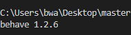
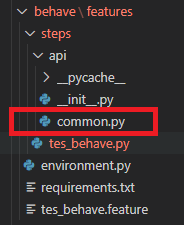
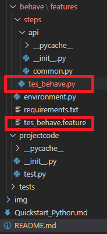
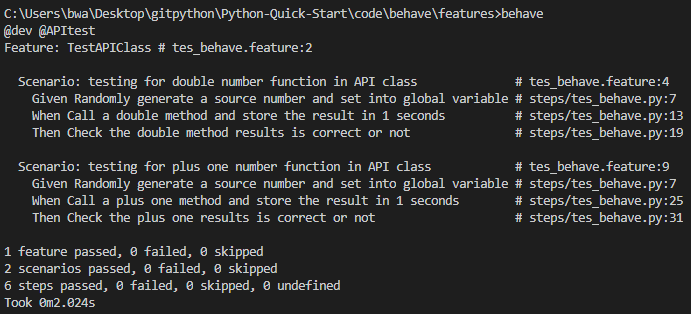

# Behave test Quick Start
   The purpose of this document is that help you quickly set up environment for Behave Test and provide a sample code let you to quickly understand how to use Behave Test in your project for integration testing, this document does not cover Python programming language learning so assume you have basic programming background. 

## Behavior Driven Development
Behavior-driven development (or BDD) is an agile software development technique that encourages collaboration between developers, QA and non-technical or business participants in a software project.
1. the advantage of behave
   1. In my understanding is that a way for non-technical people to easy understand and even to help develop tests by using Gherkin Language. it also makes integration testing clearer and easier to management.
   2. behave test is scenario based which means behave is not in unit tests level it could be leverage unit tests or beyond unit tests and test multiple modules in series.
   3. For me in the last project that is public cloud architecture based project so I was to use Behave test between different cloud services of the stability in several Behave scenarios
2. Installation of behave environment
   1. It is recommended that you install directly by using pip
    ```python
      # Execute the following command to install behave with pip:
      pip install behave

      # To update an already installed behave version, use:
      pip install -U behave
      ```
   2. Check your installation just input command 'behave --version' it should be print out behave version number in my case its 1.2.6
   ```python
   behave --version
   ```
   
3. Behave file structure
   1. you need create an behave *__.feature__* file and this file use to define test scenarios and you can create it and under the feature folder and you could use this feature folder save more feature file and each file for different test scenarios.
   2. Then you should create an steps folder for save script file this file name should same as feature file name but the the extension name is .py (the implementation code for the dealer feature) YES its seems like __Code-behind__ model but the *.feature file is basd on Gherkin Language.
   3. For steps folder you can also put some common/utility files into it or create a separate folder for me I have creat a folder name API for some common function and testing class
   - 
   4. In my case I am going to test __*CommonClient*__ class under the __*api*__ folder and in this class have 2 functions *ReturnDoubleNumber* and *ReturnNumberPlusOne* so So I tested it with two scenarios you can see that in tes_behave.feature file and the test code in tes_behave.py file
   -  
  
4. Feature and Scenario
   1. as I mentioned behave test scenario base on Gherkin Language so the test scenario seems like this:
   
         ```
         Feature: TestAPIClass

         Scenario: testing for double number function in API class
            Given Randomly generate a source number and set into global variable
            When Call a double method and store the result in 1 seconds
            Then Check the double method results is correct or not

         Scenario: testing for plus one number function in API class
            Given Randomly generate a source number and set into global variable
            When Call a plus one method and store the result in 1 seconds
            Then Check the plus one results is correct or not
         ```
   2. as you can see fist line describes the feature. In a large system, you may have many features. 
   3. next, I am add two test. these test case is super simple — the key word of Behave uses to define a test is "Scenario"
5. Scenarios
   1. for the "Scenario" or say test case, we need to understand the three phases of a basic Behave test: "Given", "When", and "Then". 
         1. "Given""initializes a state 
         2. "When" describes an action
         3. "Then" states the expected outcome. 
         4. in my case, test 2 function in API class which is supper simple, of course, in large/complex systems, this kind of integration testing is often across multiple modules and functions.
6. Scenarios Steps
   1. The steps that Behave runs in Python code and they are the link between the descriptive tests in .feature files. please reference tes_behave.py file
      1. Behave steps use annotations '@' that match the names of the phases.
      2. I share the same @GIVEN here in both Scenario
         ```python
         import random
         import time
         from api.common import CommonClient

         # testing for double number function in API class
         @given('Randomly generate a source number and set into global variable')
         def step_impl(context):
            context.apiclient = CommonClient(context.configstring)
            context.sourcenumber = random.randrange(1,50)


         @when('Call a double method and store the result in {number:d} seconds')
         def step_impl(context, number):
            context.number = context.apiclient.ReturnDoubleNumber(int(context.sourcenumber))
            time.sleep(int(number))


         @then('Check the double method results is correct or not')
         def step_impl(context):
            assert int(context.sourcenumber) * 2 == int(context.number)
         
         # Scenario: testing for plus one number function in API class
         @when('Call a plus one method and store the result in {number:d} seconds')
         def step_impl(context, number):
            context.number = context.apiclient.ReturnNumberPlusOne(int(context.sourcenumber))
            time.sleep(int(number))


         @then('Check the plus one results is correct or not')
         def step_impl(context):
            assert int(context.sourcenumber) + 1 == int(context.number)
            ```
7. Run Behave test in local   
   1. Back to the directory 'code\behave\features' and make sure your behave installation is successful by input command 'behave --version' it should be print out behave version number in my case its 1.2.6
   2. then input command 'behave' that is run behave test and you should see the output like this: 
      ```
      C:\***\Python-Quick-Start\code\behave\features>behave --version
      behave 1.2.6

      C:\***\Python-Quick-Start\code\behave\features>behave

      @dev @APItest
      Feature: TestAPIClass # tes_behave.feature:2
      ```
   - 

8. Check the result
   1. we have 1 feature and in this feature we have 2 scenarios so there result is 1 feature and 2 scenarios passed. then for each scenario we have 3 steps so in total passed 6 steps
   2. run behave test we just in put the  __behave__ command and there I would like to introduce a useful parameters its *--tags* that is use It is used to classify features. for example we have a development and a production environment and we have different features defined for two different environments. the tags an help us play behave for target env. such as __behave --tags=@dev__ in this command its only 2 Features will be executed that with @dev taged
      ```
      @dev
      Feature: TestAPIClass
      ...
      @dev
      Feature: TestFucnClass

      @production 
      Feature: TestAPIClass
      ...
      @production 
      Feature: TestFucnClass


      C:\***\Python-Quick-Start\code\behave\features>behave --tags=@dev

      ```

### Conclusion
This tutorial help you walked through setting up a new Env of Behave library. 
To learn more about BDD and why you might want to adopt it, you an check out article on [Behavior-Driven Development](https://behave.readthedocs.io/en/latest/philosophy.html).